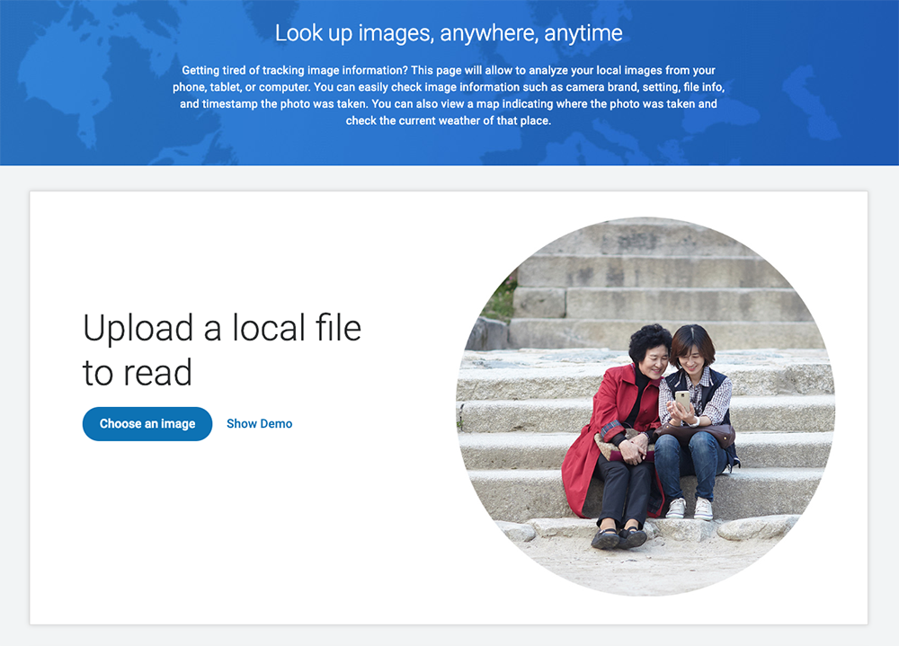

## Image-LookUp 

### Demo Link https://anthonyphoto.github.io/Image-LookUp/

### Abstract
As an iPhone/iPad user, I was hoping Apple would provide a tool to view details of local image files.  Currently the user can access only very limited information (timestamp and location), but can't check file size, dimension, shooting setting and camera info.  This is painful especially when you receive files from other devices.  This app will allow the user to analyze their local images with detailed information.

### User Stories (Functional)
* As an app user, I want to view detailed file information about my local image.
  - File Name
  - File Size (in bytes)
  - Image Dimension (in pixel)
* As an app user, I want to view detailed device information about my local image.
  - Focal Length (in mm)
  - Exposure Time (in sec)
  - Aperture (in FStop)
  - Flash
  - ISO
* As an app user, I want to view detailed camera information about my local image.
  - Camera Manufacturer
  - Camera Model
  - Used Software
  - Owner (if available)
* As an app user, I want to view the location where the pictures was taken from Google map. 
* As an app user, I want the page to be responsive, which works from various devices seamlessly.
* As an app user, I want to check the weather condition in the picture ~~at the time of when the picture was taken.~~
  - *Note: The historic weather feature is removed due to the high cost of API.  The app will show the current weather condition of the location in the picture instead.*

### Technology Used
* HTML/CSS/JavaScript/jQuery

### Sample Screenshot (Landing Page from Desktop)

### Sample Screenshot (Image-Lookup Page from Desktop)

### Sample Screenshot (Landing Page from iPhone XR)

